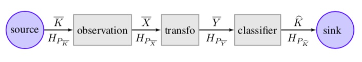

This vignette shows how to carry out Exploratory Data Analysis (EDA) on datasets prior to building classifiers, feature engineering or any other processing.

The objective is to form expectations about the performance of later data processing steps by observing the information content of the datasets. This is an instance of Infodynamics (or rather Infostatics, to be precise !)

The illustration below suggest the setting of this exploration: we initially have a source of information $\overline K$ and and observations process (unavailable to us) has produced a random vector of features $\overline X$. 

```{r echo=FALSE, out.width='100%'}

```
In this script we use datasets whose sources are single random variables (RV), but multiple features as observations, and we will use the Source Multivariate Entropy Triangle (SMET) to build these expectations. 


# Environment construction

## Knitting options

```{r setup}
knitr::opts_chunk$set(comment=NA, fig.width=6, fig.height=4)
knitr::opts_chunk$set(warning=FALSE)# Should not appear in the knitted document
```

## Library loading

```{r, echo=FALSE, warning=FALSE, environment}
library(tidyverse) # Acceding to Mr. Wickham's proposals!
library(entropies) # This package. Imports many others. 
library(ggtern)    # Primitives to print ternary densities
library(vcd)       # Categorical benchmarks
library(mlbench)   # ml benchmarks
library(candisc)   # Wine dataset
```
## Global option definition

```{r global options}
fancy <- TRUE  # set this for nicer on-screen visualization
#fancy <- FALSE # Set this for either printing matter

# A color blind palette from: http://www.cookbook-r.com/Graphs/Colors_%28ggplot2%29/#a-colorblind-friendly-palette
# The palette with grey:
#cbPalette <- c("#999999", "#E69F00", "#56B4E9", "#009E73", "#F0E442", "#0072B2", "#D55E00", "#CC79A7")
# The palette with black:
cbbPalette <- c("#000000", "#E69F00", "#56B4E9", "#009E73", "#F0E442", "#0072B2", "#D55E00", "#CC79A7")

getPlot <- TRUE # Flag to obtain plots for publication. 
getPlot <- FALSE #Comment to get .jpeg files rather than plots of ETs.
knitr::opts_chunk$set(comment=NA, fig.width=6, fig.height=4)
if (getPlot)
    knitr::opts_chunk$set(dev = 'pdf') # better for publication
```


# An example of SMET use

## Datasets available

Firts we bring in an inventory of databases to be explored. In a "real" application this would be the data to be explored. 

```{r dataset processing}
datasets <- getDatasets()
datasets
if(interactive()){#latex-ing the table for publications
    library(xtable)
    ds4latexing <- datasets %>% select(-className, -idNumber)
    row.names(ds4latexing) <- NULL
    names(ds4latexing) <- c("Dataset Name", 
                            "class card.", 
                            "num. features", 
                            "num. instances")
    thisLatex <- xtable(ds4latexing, 
                    caption="Some datasets considered in this study",
                    label="tab:datasets")
    align(thisLatex) <- xalign(thisLatex)
    thisLatex
}
```

## Obtaining the entropies

The beginning step of the exploration is to obtain the entropies from all datasets and some other data for plotting. In a typical application this would involve only the particular datasets being considered. 

We provide a convenience function getDatasetSourceEntropies for this vignette and others, coupled to the getDataset function above. 

```{r find-entropies, warning=FALSE}
edf <- data.frame()
for(i in 1:nrow(datasets)){
    dsRecord <-  datasets[i, ]
    dsName <- dsRecord$name
    edf <- rbind(
        edf,
        getDatasetSourceEntropies(
            evalDataset(dsName), 
            dsName, 
            className = dsRecord$className,
            idNumber= dsRecord$idNumber,
            withClass=TRUE, 
            type="total",
            method="emp"#Method to work out entropies,
            )
        )
}
summary(edf)
```

This returns the entropic components needed to plot the information in the SMET, along with some extra information:

* dsName: the name of the dataset being analyzed. This makes only sense when comparing different datasets, as we do.

* name: of the RV the entropies pertain to.

* isClass: whether the RV is the class or not.

* withClass: whether the entropies have been calculated taking into consideration the class or not. 

## Observing the entropy of the classes

It is important to quantify how much of the information in the class is captured in the features.

This can be captured in the triangle by considering an extended random vector $(\overline K, \overline X)$ and observing the source entropy for the classes: ideally, the information in the class should all be redundant, implying that set of features actually captures all of the information in the class.

```{r}
onlyClasses <- edf %>% filter(isClass==TRUE)
# Plot the triangle with only the aggregate data with no Class
smetClasses <-  ggmetern(onlyClasses, fancy) + 
    geom_point(mapping=aes(shape=dsName), size=3) +
    scale_shape_manual(values=1:nrow(onlyClasses)) +
    labs(shape="Dataset")
if (fancy){
    smetClasses <- smetClasses + 
        ggtitle("How is the information in  Classes captured accross datasets?")
}
smetClasses
if (getPlot){
    dev.off()#Necessary to do the textual plot.
    ggsave("multisplit_for_class_features.jpeg", plot=smetClasses)
}
```

So we can actually see that 

* Some of the information in Arthritis is *not* captured by its features. This implies that perfect classification for this dataset is impossible.

* The other databases are adequately captured by the rest of the features in the dataset. 

## Plotting aggregate data

Now we print the total entropy balance of $\overline X$ in the triangle for the different datasets. This allows us to compare the different relative compositions of the datasets. 

```{r, aggregate-DATA}
aggregateEdf <-  edf %>% 
            mutate(name=dsName) %>% # interested in whole datasets
            group_by(name, withClass) %>% # and whether the class is considered or not
            summarise(H_Ux = sum(H_Uxi),
                    H_Px = sum(H_Pxi),
                    DeltaH_Px = sum(DeltaH_Pxi),
                    VI_Px = sum(VI_Pxi),
                    M_Px = sum(M_Pxi))
```

Let's visualize the aggregate data with no Class. This tells us how redundant and balanced the random vector of the observations $\overline X$ is  and how much information it is offering. 

```{r, aggregate-SMET}
aggregateSMET <-  
    ggmetern(aggregateEdf %>% filter(withClass == FALSE), fancy) + 
        geom_point(mapping=aes(shape=name), colour="blue", size=3) +
        scale_shape_manual(values=1:nrow(datasets)) +
        labs(shape="Dataset")
if (fancy){
    aggregateSMET <- aggregateSMET + 
        ggtitle("How redundant are the features on average in each dataset?")
}
aggregateSMET
if (getPlot){
    dev.off()#Necessary to do the textual plot.
    ggsave("aggregated_without_label.jpeg", plot=aggregateSMET)
}
```
We can see tha.

* Arthritis and, to a lesser extent  Iris and Breastcancer are less redundant than expected. That is, there are many features with irredundant information (with respect to their peers). Later processing stages have to worry about all features, in general. 

* Breastcancer has notoriously less total information to offer than the other databases, being quite unbalanced and with a measure of irredundancy. 

Aggregate triangles cannot offer more information: if we want to consider each feature independently, we have to use the split triangle (see below).

## The SMET does not report transmitted information

Since the class is in the source and it has some information about  each of the features. We next see this effect.

```{r}
smet <-  ggmetern(aggregateEdf, fancy) + 
    geom_point(mapping=aes(shape=name, color=withClass), size=3) +
    #scale_colour_manual(values=cbbPalette) +
    scale_color_manual(values=c("blue", "black")) +
    scale_shape_manual(values=1:nrow(datasets)) +
    labs(shape="Dataset", colour="Including class")
if (fancy){
    smet <- smet + ggtitle("Redundancy including the class")
}
smet
if (getPlot){
    dev.off()#Necessary to do the textual plot.
    ggsave("aggregated_withWo_label.jpeg", plot=smet)
}
```

Clearly the class has a lot of information about the features. 
But the SMET does not concern itself with quantifying how much of the information in the class is transmitted to the individual or collective set of features. For this we need the Channel Binary or Multivariate Entropy Triangles (see their respective vignettes).

## Plotting the multisplit data

We next go back to the question of how much independent information each of the features have. 

We choose some of the interesting datasets from the diagram above to investigate:

```{r, specific-data}
#TODO: make a grid of these plots to be able to see anything different. 
#thisDsName <- "Ionosphere" # CAVEAT! Not enough different glyphs!!!
thisDsName <- "iris" # for paper, we first run this value, then "Glass"
# thisDsName <- "Glass"
# thisDsName <- "Arthritis"
# thisDsName <- "BreastCancer"
# thisDsName <- "Sonar"
# thisDsName <- "Wine"
# negatively subsetting recipe from Stack Overflow
thisEdf <- edf %>% filter(dsName == thisDsName & name != "ALL") %>% 
                      select(-starts_with("isClass"))
thisEdf <- rbind(thisEdf,
                 ungroup(aggregateEdf) %>% 
                      filter(name == thisDsName) %>% 
                      mutate(dsName=name, name = "@AGGREGATE") %>%
                      select(name, 
                             H_Uxi=H_Ux, H_Pxi=H_Px, 
                             DeltaH_Pxi=DeltaH_Px,
                             M_Pxi=M_Px, 
                             VI_Pxi=VI_Px,
                             withClass, 
                             dsName)
                )
```

Create different geometries for different feature set cardinalities:
first consider the features in the dataset without the class variable.
```{r feature-triangle}
thisEt <-  ggmetern(filter(thisEdf, withClass == FALSE),  fancy) 
if ((nrow(thisEdf) - 1)/2 >= 14){#too many points for with glyphs
    thisEt <- thisEt + 
        stat_density_tern(geom='polygon',
                        aes(fill=..level..),
                        #base=base,  ###NB Base Specification
                        colour='grey50') + 
        scale_fill_gradient(low='green',high='red')  +
        geom_point(size=1)
}else {
    thisEt <- thisEt + geom_point(aes(shape=name), size=3) +
        scale_shape_manual(values=1:14) + 
        labs(shape="Feature") #+
    #ggtitle("Source Multivariate Entropies per Feature")
}
thisEt
if (getPlot){
    dev.off()
    ggsave(filename=sprintf("%s_without_class.jpeg", thisDsName))
}
```
By changing the chosen $dsName$ we could find some explanations why each dataset behaved as in previous sections. 

Next consider the same set with the class label included.
```{r}
thisEt <-  ggmetern(thisEdf, fancy) 
if ((nrow(thisEdf) - 1)/2 >= 14){#too many points to be represented with glpsh
    thisEt <- thisEt + #geom_density_tern(aes(fill=..level..)) +
        stat_density_tern(geom='polygon',
                        aes(fill=..level..),
                        #base=base,  ###NB Base Specification
                        colour='grey50') + 
        scale_fill_gradient(low='green',high='red')  +
        geom_point(size=1)
}else {
    thisEt <- thisEt + geom_point(aes(shape=name, colour=withClass), size=3) +
        scale_shape_manual(values=1:14) + 
        #scale_color_discrete("color_blind")
        scale_colour_manual(values=cbbPalette)
    #ggtitle("Source Multivariate Entropies per Feature")
}
thisEt + labs(shape="Feature", color="Using class") #+
if (getPlot){
    dev.off()
    ggsave(filename=sprintf("%sW_WO_class.jpeg", thisDsName))
}
```

Since the database being analyzed is iris, recall that its class variable is name ´Species´. In this diagram we see:

* how the information of Species is completely redundant, despite the fact that none of the individual features was individually redundant.

* For this reason, the set of features $\overline X$ in this case is a information lossless representation of the class $\overline K$, indeed a good representation. 

## Other representations for information balances

We are next comparing two visualizations for the entropy in the features of a dataset. 

### The decomposition of feature entropies

The first one are stacked bars, where each of the components is marked in the standard colors in the decomposition. 

```{r stacked-bars}
# In case the switch is ON for excluding the aggregate.
excludeAggregate <- TRUE
#excludeAggregate <- FALSE

analyzeWithClass <- FALSE
#analyzeWithClass <- TRUE
if (analyzeWithClass){
    smedf <- filter(thisEdf, withClass) %>% select(-withClass)
} else {
# For this once let's just use the entropy with no class variable
    smedf <- filter(thisEdf, !withClass) %>% select(-withClass) # source multivariate entropy data frame
}
p <-  ggmebars(smedf, excludeAggregate,proportional=FALSE)
p + ylab("Source Multivariate Entropy") + xlab("Feature/Variable") #+
    #ggtitle("Absolute Source Multivariate Entropies per Feature")
    # scale_y_continuous(trans=log2_trans(),
    #                 breaks=trans_breaks("log2", function(x) 2^x),
    #                 labels=trans_format("log2", math_format(2^.x)))
# 
if (getPlot){
    dev.off()
    ggsave(filename=sprintf("%s_entropy_bars_noAgg.jpeg", 
                            thisDsName))
}
```

This is certainly illustrative and shows the partition nicely to the trained eye. Even the decreasing bars suggests that the most informative feature is the first one. However, the important concept for a feature is is remanent entropy, so why not order it that way?

The multisplit SMET can also offer this ordering information with a different encoding: using the fill color on the glyphs used to represent the maximum entropy per feature. The other informations in the balance are not ordered but simply stem off from the diagram: in particular de remanent entropy correlates with distance from the right side. 

```{r absolute-SMET}
ggmetern(filter(smedf, name != "@AGGREGATE"), fancy) +
    geom_point(size=4, aes(shape=name, colour=H_Uxi)) + 
    scale_shape_manual(values=1:14) +
    scale_color_gradient(low="grey", high="black") +
    labs(shape="Feature", colour="$\\textit{H_{U_{X_i}}}") 
    #theme(legend.position="bottom")
if (getPlot){
    dev.off()
    ggsave(filename=sprintf("%s_smet_noAgg_absoluteEntropy.jpeg", 
                            thisDsName))
}
```

Note how this is a necessary exploratory step prior to a multivariate transformation to gain independence between features, etc. 

However, turning the stacked bar graph into a pie chart is a bad idea, since the remaining information $VI_{P_{X_i}}$ is de-emphasized (that is, compare with the area in the stacked bar graph above). To a certain extent, this is equivalent to the Source Multivariate Entropy Triangle:

```{r entropy-pie}
 p + ylab("Source Multivariate Entropy") + xlab("Feature/Variable") + coord_polar() #+
    #ggtitle("Relative Source Multivariate Entropies per Feature")
if (getPlot){
    dev.off()
    ggplot2::ggsave(filename=sprintf("%s_entropy_pie_noAgg.jpeg", 
                                     thisDsName))
}
```

# Postscriptum

More information about the evaluation of sources with the Source Multivariate Entropy Triangle can be found in 

```{r echo=FALSE}
library(bibtex)
print(citation("entropies")['val:pel:17b'], style="text")
```

# Session information

```{r}
sessionInfo()
```
